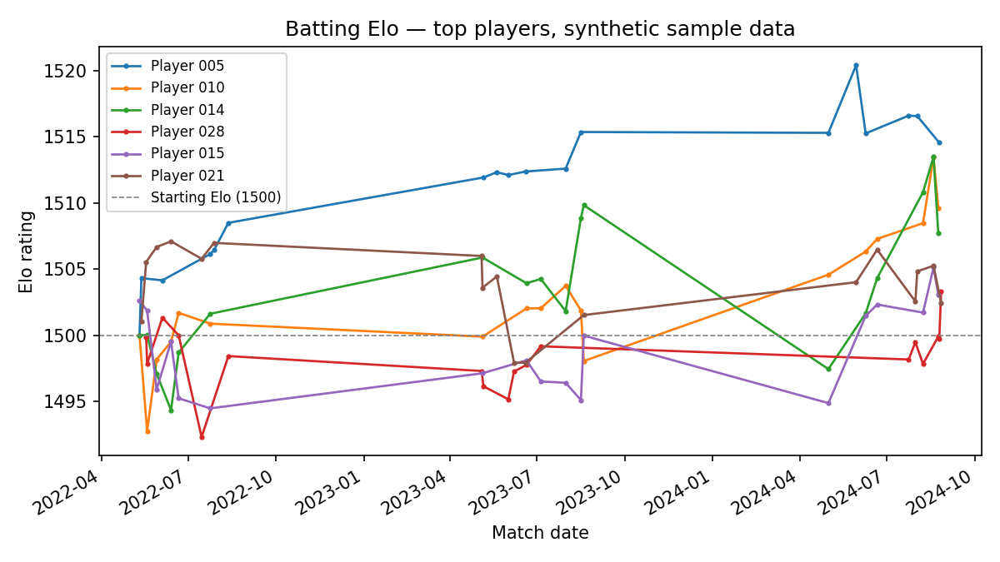

A Model Isn't Finished Until Someone Else Can Run It
I built a talent-identification model for my MSc. Then I tried to make it run without me.

---

A model that works on one laptop, for one person, isn't really finished — it just works. My MSc Elo model worked. It ran, it produced ratings, it answered the research questions I'd set out to answer. It also needed exactly one thing to work: me. My laptop, my Python environment, my folder structure, my access to a private database.

That's a perfectly normal way for a dissertation to end. It's a less convincing way for a piece of software to end.

THE QUESTION
Could somebody else actually run this?

I came back to the project recently with a deliberately narrow question, unrelated to the analysis itself: if I sent someone this repository right now, could they get it running? Not deploy it. Not wrap it in an API. Not introduce Kubernetes because someone on LinkedIn said I should. Just: clone it, and get a real answer out of it, without configuring my Python environment or knowing anything about where my data came from.

The honest answer was no. And the reasons why turned out to be more interesting than the fix.

THE DATA PROBLEM
I didn't have the data anymore — and that turned out to matter

The original Elo engine was built against a private research database, using credentials and infrastructure I no longer have access to. That looked, at first, like the obvious blocker: no data, no demonstration.

It forced a better question instead. Why did the rating engine need to know where its data came from at all? Whether a match record originated in a database, a CSV, or someone typing scores into Excel shouldn't change how an Elo rating gets calculated. The coupling between "the model" and "my specific data source" wasn't a design decision — it was just what research code under deadline pressure tends to look like.

So I separated the two ideas properly. The engine now takes two dataframes — batting and bowling records — and doesn't care where they came from.

```text
Private database ─┐
CSV ────────────────┼──► Elo engine ──► Player ratings
Synthetic data ─────┘
```

Same engine, three possible inputs. The public repository only ever exercises the third one.

For the public version, those dataframes come from a small synthetic-data generator, matching the schema the real pipeline expects. The numbers aren't trying to simulate English domestic cricket. They only have one job: prove that, given correctly structured input, the pipeline runs end to end.

THE OUTPUT
What the pipeline actually produces



Six players from that synthetic dataset, batting Elo across three seasons. None of this is real, and it doesn't need to be — the point isn't that Player 005 is good, it's that the pipeline produces something structurally identical to what the real model does, from data nobody outside this repository has ever seen.

THE CONTAINER
What a boring Dockerfile actually needs

Once the model no longer cared about its data source, the container itself was almost an anticlimax. It needs to know four things: which Python to start from, which dependencies to install, which files to copy in, and which single command to run.

```dockerfile
FROM python:3.12-slim
WORKDIR /app
COPY requirements.txt .
RUN pip install --no-cache-dir -r requirements.txt
COPY src/ ./src/
CMD ["python", "src/run_model.py"]
```

That's it. No multi-stage builds, no orchestration, nothing clever.

The moment that actually mattered wasn't writing the Dockerfile. It was the first time `docker build` and `docker run` both succeeded against a completely clean clone — not my working directory, an actual fresh `git clone` on its own, with nothing left over from my machine. Previously, the model worked because my laptop happened to contain the right combination of packages and files. Now the environment was part of the project, not an assumption underneath it.

BREAKING IT ON PURPOSE
Testing what should always be true

Working once isn't the same as staying correct. So I added a small test suite — not an attempt to re-verify the dissertation's statistics, just a handful of properties that should always hold: the engine produces the expected output shape, ratings stay finite, a player's rating genuinely doesn't move before they've cleared the minimum-experience threshold, the synthetic generator produces valid input. Then a GitHub Actions workflow, so every push has to answer three questions in order — do the tests still pass, does the image still build, does the container still run?

[Screenshot: three green checks in GitHub Actions]

Three pushes, three green checks. Every one of them ran the same sequence: tests, then build, then run.

If any one of those breaks, the badge at the top of the README breaks with it — which is a much smaller thing to fix than discovering, months later, that the pipeline quietly stopped working.

WHAT ACTUALLY CHANGED
The model didn't get better. Something else did

Nothing about this made the Elo ratings more accurate. The AUC didn't move. No player suddenly looks more like an England prospect than they did before. If you were only grading this on the original research question, none of the last few days would show up anywhere.

What changed sits one level up from the analysis. I now have much higher confidence that this code runs correctly outside the specific environment it happened to be written in — which is a different kind of correctness than the statistical kind, and one that research work usually doesn't have to demonstrate at all. A dissertation gets marked on whether the analysis holds up. Software also has to survive outside the environment it was written in. Those turned out to be genuinely separate bars, and I'd only ever cleared one of them.

WHERE THIS LEAVES ME
A different definition of finished

I'm deliberately not turning a small, working Elo container into infrastructure it doesn't need. No API, no cloud deployment, no orchestration layer justifying itself after the fact. The useful next steps are smaller — tighter tests, a cleaner interface between data and modelling, maybe eventually a way to generate ratings from a new dataset without touching the code at all.

The repository — the Elo engine, synthetic-data generator, tests and CI workflow — is public and buildable end to end.

The model itself hasn't changed. My definition of finished has.

https://github.com/tmnnngs247/elo-cricket-docker
